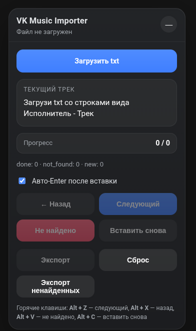

# 🎵 VK Music Importer

A Chrome Extension for transferring large music libraries into VK Music from a plain text export with progress persistence, keyboard shortcuts and seamless integration with the VK interface.

> Browser extension built to automate repetitive music migration by interacting directly with the VK Music web interface.

<p align="center">
  
</p>

---

## 🛠 Tech Stack

   

### Browser APIs

- Chrome Storage API
- FileReader API
- DOM API
- MutationObserver
- Keyboard Events
- Blob API

---

## ✨ Features

- 🎵 Import tracks from TXT playlist
  - Read large text files
  - Start from the last track
  - Progress persistence
  - Resume after browser restart

- 🔍 Smart VK Music integration
  - Automatic search input
  - Search query normalization
  - Auto Enter
  - Dynamic DOM interaction

- ⚡ Productivity
  - Keyboard shortcuts
  - Previous / Next navigation
  - Not Found marking
  - Reinsert current track

- 💾 State management
  - chrome.storage.local
  - Automatic session restore
  - Track status persistence

- 📄 Export
  - Export processed playlist
  - Export only missing tracks
  - Resume migration at any time

---

# 🏗 Architecture

```
vk-music-importer/
│
├── manifest.json
├── content.js
└── content.css
```

The extension injects a custom control panel into the VK Music page and communicates directly with the existing interface using the browser DOM APIs.

Workflow:

```
TXT file
     │
     ▼
 FileReader
     │
     ▼
 Track parser
     │
     ▼
 Query normalization
     │
     ▼
 VK Search Input
     │
     ▼
 User selects track
     │
     ▼
 chrome.storage.local
```

---

# 📦 State

Each track is stored with its processing status.

```ts
{
  text: string;
  status: "new" | "done" | "not_found";
}
```

The extension automatically restores:

- loaded playlist
- current position
- processed tracks
- missing tracks

---

# ⚙ How it works

1. Load a TXT playlist
2. Extension starts from the last track
3. Automatically inserts the search query into VK Music
4. User manually adds the correct song
5. Press **Next**
6. Extension stores progress
7. Continue until the playlist is finished

---

# 🚀 Getting Started

Clone repository

```bash
git clone https://github.com/fndya/vk-music-importer.git
```

Open Chrome Extensions

```
chrome://extensions
```

Enable

```
Developer Mode
```

Load

```
Load unpacked
```

Select project folder.

---

# 🎯 Learning Goals

This project was built to practice:

- Chrome Extensions (Manifest V3)
- Browser APIs
- File processing
- DOM manipulation
- Dynamic web application integration
- State persistence
- Event-driven architecture
- UI injection
- Hotkeys
- Working with third-party SPAs

---

# 💡 Interesting Challenges

During development several technical challenges had to be solved:

- interacting with dynamically rendered VK Music components
- generating native input and keyboard events
- selecting stable DOM elements instead of dynamic React-generated IDs
- preserving application state between browser sessions
- synchronizing the injected UI with page updates using MutationObserver

---

# 📄 License

Personal open-source project.